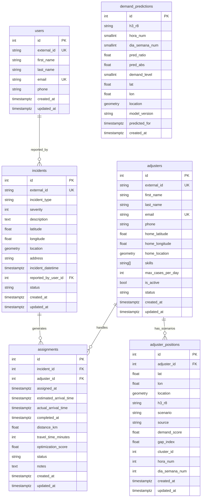
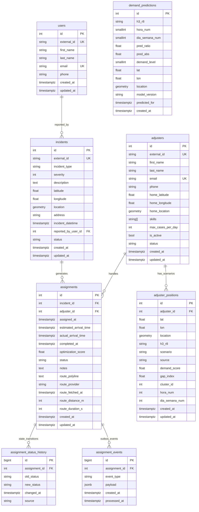
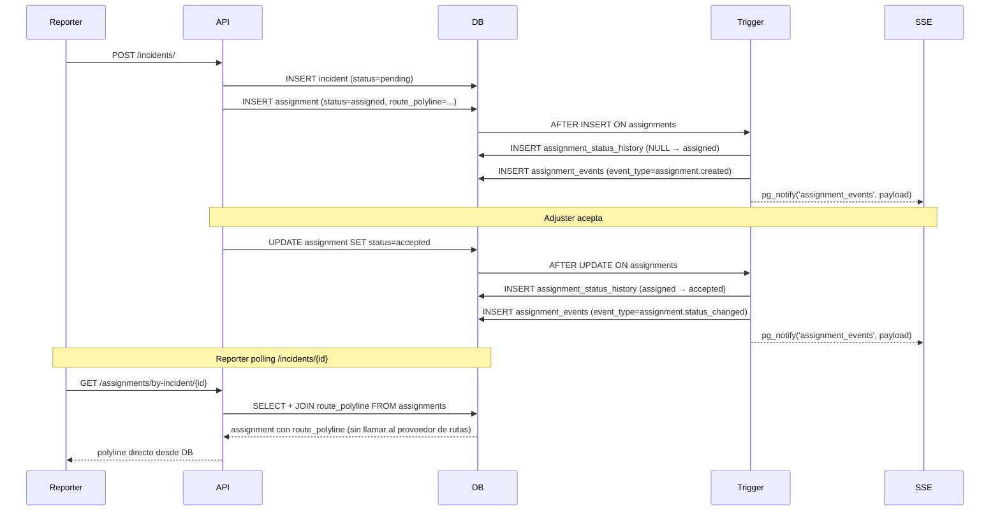

# Database Schema Proposal — Despacho POC

**Fecha:** 2026-04-10
**Basado en:** adjuster-optimizer schema actual + investigación de mejores prácticas
**Contexto:** POC sin login. PostgreSQL 16 + PostGIS 3.4 en GCE.

---

## 1. Esquema Actual (baseline)

### Diagrama ER actual



### Brechas identificadas en el esquema actual

| # | Brecha | Impacto |
|---|--------|---------|
| 1 | `assignments` no guarda la ruta (polyline) | Se recalcula en cada carga de página — latencia innecesaria y costo en proveedor de rutas |
| 2 | No existe historial de estados de asignación | Cuando status cambia de `accepted→en_route`, el estado anterior se pierde para siempre |
| 3 | `pg_notify` dispara pero no persiste | Si el consumer SSE está caído, el evento se pierde — no hay replay posible |
| 4 | `demand_predictions` unique en `(h3_r8, predicted_for)` | Imposible comparar predicciones de dos versiones del modelo para el mismo slot |
| 5 | `demand_predictions` sin particionado | Con una predicción por celda H3 (≈300 celdas en CDMX) × 168 slots/semana = 50K filas/semana — crece indefinidamente |
| 6 | `skills` como `ARRAY(String)` en adjusters | Funciona para POC, pero no es filtrable eficientemente con índices B-tree |
| 7 | Sin tabla de GPS real-time | `adjuster_positions` es para escenarios de optimización, no para tracking en vivo |

---

## 2. Investigación: ¿Guardar polylines en DB?

### Opciones evaluadas

| Opción | Storage | Spatial queries | Recomendado para |
|--------|---------|-----------------|-----------------|
| `Geometry(LINESTRING)` PostGIS | ~2-5KB/ruta (WKB) | ✅ Completo (ST_Length, ST_Intersection, etc.) | Si necesitas análisis espacial de rutas |
| `TEXT` encoded polyline | ~0.5-1KB/ruta | ❌ No sin decodificar | POC, lectura directa por frontend |
| `JSONB` array de coords | ~3-8KB/ruta | ⚠️ GIN, sin geo-ops | Nunca — peor de ambos mundos |

### Decisión: TEXT (encoded polyline) ✅

**Razones para este POC:**
- El frontend consume directamente el encoded polyline (Leaflet + `L.PolylineUtil.decode`)
- No necesitamos preguntas del tipo "¿qué ruta pasa por esta zona?"
- Reduce llamadas al proveedor de rutas en un ~90% en el flujo normal (reporter polling, adjuster reload)
- Compacto: ~600 bytes por ruta típica en CDMX

**Columnas a agregar a `assignments`:**
```sql
route_polyline        TEXT           -- Google encoded polyline
route_provider        VARCHAR(50)    -- 'osrm' | 'valhalla' | 'google'
route_fetched_at      TIMESTAMPTZ    -- cuándo se calculó la ruta
route_distance_m      INTEGER        -- metros (más preciso que km float)
route_duration_s      INTEGER        -- segundos
```

### Decisión: Historial de estados ✅

La investigación es unánime: perder el histórico de `assigned→accepted→en_route→arrived→completed` elimina toda posibilidad de:
- Calcular tiempos de respuesta por tipo de siniestro
- Detectar ajustadores lentos en aceptar
- Generar reportes de SLA para el asegurado

La solución más simple para POC es una **tabla de historial disparada por trigger**, no event sourcing completo.

---

## 3. Esquema Propuesto

### 3.1 Cambios a tablas existentes

**`assignments` — agregar columnas de ruta:**
```sql
route_polyline    TEXT
route_provider    VARCHAR(50)
route_fetched_at  TIMESTAMPTZ
route_distance_m  INTEGER        -- reemplaza distance_km (más preciso)
route_duration_s  INTEGER        -- reemplaza travel_time_minutes (más preciso)
```
> `distance_km` y `travel_time_minutes` se mantienen por compatibilidad pero se deprecan.

**`demand_predictions` — cambiar unique constraint:**
```sql
-- Antes: UNIQUE(h3_r8, predicted_for)
-- Después: UNIQUE(h3_r8, predicted_for, model_version)
-- Permite comparar modelos v1 vs v2 para el mismo slot
```

### 3.2 Tablas nuevas

**`assignment_status_history`** — audit trail inmutable de transiciones de estado:
```sql
CREATE TABLE assignment_status_history (
    id             BIGSERIAL PRIMARY KEY,
    assignment_id  INTEGER NOT NULL REFERENCES assignments(id) ON DELETE CASCADE,
    old_status     VARCHAR(20),          -- NULL en la inserción inicial
    new_status     VARCHAR(20) NOT NULL,
    changed_at     TIMESTAMPTZ NOT NULL DEFAULT NOW(),
    source         VARCHAR(50)           -- 'adjuster_action' | 'system' | 'admin_override'
);

CREATE INDEX ix_ash_assignment_id ON assignment_status_history(assignment_id);
CREATE INDEX ix_ash_changed_at    ON assignment_status_history(changed_at DESC);
```
> Poblada por trigger `AFTER INSERT OR UPDATE OF status ON assignments`.
> `BIGSERIAL` porque esta tabla crece con cada transición (hasta 6 filas por asignación).

**`assignment_events`** — outbox para pg_notify (replay en caso de consumer caído):
```sql
CREATE TABLE assignment_events (
    id             BIGSERIAL PRIMARY KEY,
    assignment_id  INTEGER NOT NULL REFERENCES assignments(id) ON DELETE CASCADE,
    event_type     VARCHAR(50) NOT NULL,   -- 'assignment.created' | 'assignment.status_changed'
    payload        JSONB NOT NULL,
    created_at     TIMESTAMPTZ NOT NULL DEFAULT NOW(),
    processed_at   TIMESTAMPTZ            -- NULL = pendiente de procesar
);

CREATE INDEX ix_ae_unprocessed ON assignment_events(created_at) WHERE processed_at IS NULL;
CREATE INDEX ix_ae_assignment_id ON assignment_events(assignment_id);
```
> El listener SSE marca `processed_at` al enviar. Permite replay si el consumer se cayó.

---

## 4. Diagrama ER Propuesto



---

## 5. Flujo de datos con el nuevo esquema



---

## 6. Triggers propuestos

### Trigger: status history + outbox (reemplaza el trigger actual de notify)

```sql
CREATE OR REPLACE FUNCTION handle_assignment_change()
RETURNS TRIGGER AS $$
DECLARE
    payload JSONB;
    event_type TEXT;
BEGIN
    -- 1. Registrar transición de estado en historial
    IF (TG_OP = 'INSERT') OR (OLD.status IS DISTINCT FROM NEW.status) THEN
        INSERT INTO assignment_status_history
            (assignment_id, old_status, new_status, source)
        VALUES (
            NEW.id,
            CASE WHEN TG_OP = 'INSERT' THEN NULL ELSE OLD.status END,
            NEW.status,
            'system'
        );
    END IF;

    -- 2. Determinar tipo de evento
    event_type := CASE
        WHEN TG_OP = 'INSERT' THEN 'assignment.created'
        WHEN OLD.status IS DISTINCT FROM NEW.status THEN 'assignment.status_changed'
        ELSE NULL
    END;

    -- 3. Si hay evento relevante, insertar en outbox + notificar
    IF event_type IS NOT NULL THEN
        payload := jsonb_build_object(
            'assignment_id', NEW.id,
            'adjuster_id',   NEW.adjuster_id,
            'incident_id',   NEW.incident_id,
            'status',        NEW.status,
            'event',         event_type
        );

        INSERT INTO assignment_events (assignment_id, event_type, payload)
        VALUES (NEW.id, event_type, payload);

        PERFORM pg_notify('assignment_events', payload::text);
    END IF;

    RETURN NEW;
END;
$$ LANGUAGE plpgsql;

-- Reemplaza trg_assignment_notify
DROP TRIGGER IF EXISTS trg_assignment_notify ON assignments;
CREATE TRIGGER trg_assignment_change
AFTER INSERT OR UPDATE ON assignments
FOR EACH ROW EXECUTE FUNCTION handle_assignment_change();
```

---

## 7. Lo que se deja para después (fuera del POC)

| Mejora | Razón para posponer |
|--------|---------------------|
| Particionado de `demand_predictions` por mes | Solo relevante cuando supere ~500K filas |
| Tabla normalizada `skills` + `adjuster_skills` | ARRAY(String) es suficiente para <500 ajustadores |
| `adjuster_gps_pings` para tracking en tiempo real | Requiere integración con GPS del dispositivo móvil |
| UUIDs como PK | Complejidad innecesaria en POC single-instance |
| FSM enforced en DB (pgfsm / CHECK constraints) | Application layer ya lo controla |
| `demand_model_runs` para provenance de modelos | Cuando haya >1 versión de modelo en producción |

---

## 8. Resumen de cambios a implementar

### Alembic migration nueva: `2026_04_10_schema_improvements`

**Orden de operaciones:**

1. `ALTER TABLE assignments ADD COLUMN route_polyline TEXT`
2. `ALTER TABLE assignments ADD COLUMN route_provider VARCHAR(50)`
3. `ALTER TABLE assignments ADD COLUMN route_fetched_at TIMESTAMPTZ`
4. `ALTER TABLE assignments ADD COLUMN route_distance_m INTEGER`
5. `ALTER TABLE assignments ADD COLUMN route_duration_s INTEGER`
6. `CREATE TABLE assignment_status_history (...)`
7. `CREATE TABLE assignment_events (...)`
8. `DROP TRIGGER trg_assignment_notify ON assignments`
9. `DROP FUNCTION notify_assignment_event()`
10. `CREATE FUNCTION handle_assignment_change()` (trigger unificado)
11. `CREATE TRIGGER trg_assignment_change`
12. `DROP INDEX ix_demand_predictions_unique` (si existe)
13. `CREATE UNIQUE INDEX ON demand_predictions(h3_r8, predicted_for, model_version)`

### Cambios en código Python (services/api)

| Archivo | Cambio |
|---------|--------|
| `models/assignment.py` | Agregar 5 columnas de ruta |
| `schemas/assignment.py` | Exponer `route_polyline`, `route_distance_m`, `route_duration_s` en `AssignmentRead` |
| `services/assignment_service.py` | Al crear asignación, persistir polyline desde la respuesta del proveedor |
| `routes/notifications.py` | Al enriquecer evento SSE, marcar `assignment_events.processed_at` |
| `core/notifier.py` | Sin cambios — trigger ya emite pg_notify |

---

## Fuentes consultadas

- PostGIS ST_AsEncodedPolyline: https://postgis.net/docs/ST_AsEncodedPolyline.html
- PostgreSQL Trigger Audit Log: https://medium.com/israeli-tech-radar/postgresql-trigger-based-audit-log-fd9d9d5e412c
- Ultimate Guide to PostgreSQL Data Change Tracking: https://exaspark.medium.com/the-ultimate-guide-to-postgresql-data-change-tracking-c3fa88779572
- Temporal Tables vs Event Sourcing: https://event-driven.io/en/temporal_tables_and_event_sourcing/
- FSM in PostgreSQL: https://raphael.medaer.me/2019/06/12/pgfsm.html
- ACORD Reference Architecture: https://www.acord.org/standards-architecture/reference-architecture
- PostgreSQL Partitioning: https://www.postgresql.org/docs/current/ddl-partitioning.html
